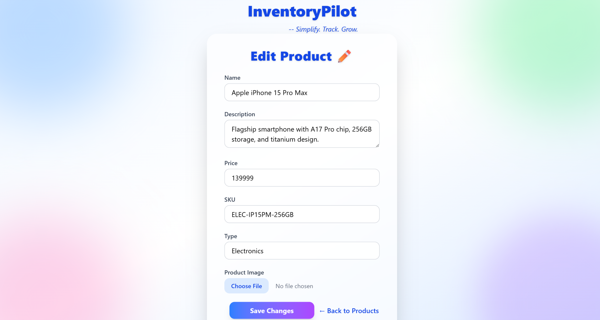

# 🧮 InventoryPilot

A full-stack MERN application to manage product inventory with authentication, image uploads, quantity tracking, and analytics.

**Tagline:** *"Simplify. Track. Grow."*

---

### 🚀 Live Demo

🔗 [Deployed Live on Vercel](https://inventory-pilot-frontend.vercel.app/)<br>
📂 [Backend GitHub Repository](https://github.com/atharva5924/InventoryPilot-backend)


---

### 🌟 Features

- 🔐 **JWT-based Auth**: Login and register with secure cookie-based JWT authentication  
- 🧑‍💼 **User Dashboard**: Beautiful UI after login with access to all product-related operations  
- 🛍️ **Add/Edit Products**: Easily add new products or update existing ones with quantity and category  
- 📉 **Update Quantity**: Directly modify product stock values with intuitive UI  
- 📊 **Interactive Charts**:  
  - 📈 **Pie Chart**: Shows stock distribution across categories  
  - 📊 **Bar Chart**: Visualizes stock levels by product name  
- 🌈 **Modern UI**: Fully responsive layout with animated gradient background, glowing elements, and glassmorphic cards  
- 💾 **Persistent Session**: Maintains login state via HTTP-only cookies  
- ☁️ **Cloudinary Integration**: Product images are uploaded to and served from Cloudinary  
- 🔄 **Real-time Feedback**: Smooth transitions, toast alerts, and form validations for a better UX  

---

## 📁 Tech Stack

- **Frontend**: React.js, Tailwind CSS, Vite
- **Backend**: Node.js, Express.js, MongoDB, Mongoose
- **Cloudinary**: Image upload handling via multer-cloudinary
- **Auth**: JWT (stored in cookies)
- **Docs**: Swagger (OpenAPI 3.0)

---

## 🔧 Getting Started

### 1. Clone the repo

```bash
git clone https://github.com/atharva5924/InventoryPilot-frontend.git
cd PinPointMap-frontend
```

### 2. Frontend Setup

```bash
git clone https://github.com/atharva5924/PinPointMap-frontend.git
npm install
# Create .env if needed
npm run dev
```

### 3. Backend Setup

```bash
git clone https://github.com/atharva5924/PinPointMap-backend.git
cd PinPointMap-backend
npm install
```
### Create .env with MONGO_URI and PORT (e.g. 5000)
```env
PORT=5000
MONGODB_URI=your_mongodb_uri
ACCESS_TOKEN_SECRET=your_jwt_secret
CLOUDINARY_CLOUD_NAME=your_cloudinary_name
CLOUDINARY_API_KEY=your_api_key
CLOUDINARY_API_SECRET=your_api_secret
```
```
npm start
```
---

## 📦 API Endpoints

### 🧑 Auth Routes

| Method | Endpoint     | Description          |
|--------|--------------|----------------------|
| POST   | `/register`  | Register new user    |
| POST   | `/login`     | Login existing user  |
| GET    | `/logout`    | Logout current user  |

---

### 📦 Product Routes

| Method | Endpoint        | Description         |
|--------|------------------|---------------------|
| GET    | `/products`      | Get all products    |
| POST   | `/products`      | Add new product     |
| PUT    | `/products/:id`  | Edit product        |
| DELETE | `/products/:id`  | Delete product      |

> ⚠️ All product routes require authentication via cookies.

---

## Project Structure

```bash
ims-backend/
│
├── controllers/
├── middlewares/
├── models/
├── routes/
├── utils/
├── uploads/ (optional if storing locally)
├── .env
├── server.js
│
ims-frontend/
│
├── src/
│   ├── components/
│   ├── pages/
│   ├── services/
│   └── App.jsx
├── index.html
├── tailwind.config.js
├── vite.config.js
```

---

## 🧩 Screenshots

## 📸 UI Screenshots

### 🧑‍💼 Login Page

Simple and clean login interface for authenticated access to the portal.


---

### 📝 Register Page

User registration screen to securely create a new account.


---

### 🏠 Dashboard – Inventory Overview

Main interface after login, showing product inventory and quick actions.


---

### ✏️ Add New Product

Form to add a new product to the inventory with quantity and pricing details.


---

### 🛠️ Edit Product

Edit existing product details like name, price, or quantity.



---

### 🔄 Update Product Quantity

Quickly increase or decrease stock count using the quantity update UI.


---

### 📊 Inventory Bar Chart

Bar chart visualization of product count by category/type.


---

### 🥧 Inventory Pie Chart

Pie chart showing proportion of different product categories in the inventory.


---

### ✅ Notes

- All screenshots are captured with real sample data inserted for demonstration.
- UI is fully responsive and clean, ensuring a great experience across devices.

---

## 🧪 Testing

Use [Postman](https://www.postman.com/) or a similar API client to test the backend API routes.

- ✅ Make sure to **enable cookies** when testing **protected routes** like product CRUD operations.
- 🔐 Authenticated routes rely on `HTTP-only` cookies for session management.

---

### 👨‍💻 Developer

**Atharva Nile**
CSE Undergrad @ IIIT Nagpur
📧 atharvanile2005@gmail.com
🔗 [LinkedIn](https://www.linkedin.com/in/atharva-nile-a50120294) • [GitHub](https://github.com/atharva5924)

---

Let me know if you want:
- A Hindi/Marathi short version.
- Custom badges or GIF recording.

I'll tailor the README further based on your preferences or interviewer expectations.


---


